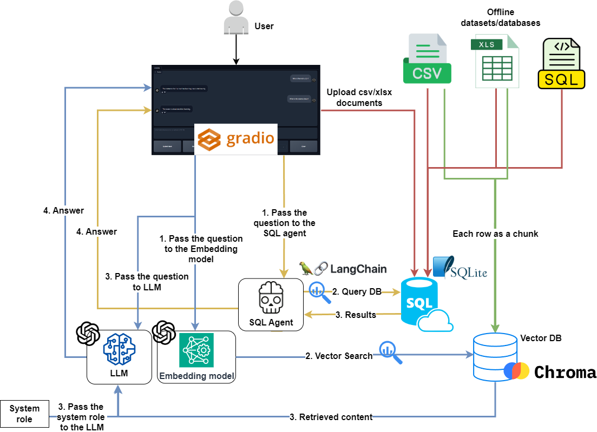

# Q&A-and-RAG-with-SQL-and-TabularData

**Q&A-and-RAG-with-SQL-and-TabularData** is a chatbot project utilizing **GPT-3.5, LangChain, SQLite, and ChromaDB**, allowing users to interact with **SQL databases, CSV, and XLSX files** using natural language for **Q&A and Retrieval-Augmented Generation (RAG)**.

### **Key Note**
It is **strongly advised** not to use SQL databases with **WRITE** privileges. Restrict access to **READ-ONLY** mode to prevent unintended data manipulation.

---

## Features
- **Chat with SQL Databases** – Query structured data using natural language.
- **Chat with Preprocessed CSV/XLSX Data** – Access stored tabular datasets.
- **Chat with Uploaded CSV/XLSX Files** – Process new files in real-time.
- **RAG with Tabular Datasets** – Retrieve and augment responses using stored structured data.

---

## Core Techniques
- **LLM Chains and Agents**
- **GPT Function Calling**
- **Retrieval-Augmented Generation (RAG)**

---

## Model Used
- **GPT-3.5** – [Details](https://platform.openai.com/docs/models)

---

## System Requirements
- **Operating System:** Linux or Windows (Tested on **WSL for Windows**).
- **OpenAI / Azure OpenAI Credentials:** Required for GPT functionality.

---

## Installation

### **1. System Setup**
```
sudo apt update && sudo apt upgrade
python3 -m venv sql-raggpt-env
git clone <repository>
```

### **2. Navigate to the Project Directory**
```
cd SQL-RAG-GPT
```

### **3. Activate the Virtual Environment**
```
source ...Path to the environment/sql-raggpt-env/bin/activate
pip install -r requirements.txt
```

---

## Execution

### **1. Preparing a SQL Database from a `.sql` File**
Copy the `.sql` file into the `data/sql` directory, then install SQLite:
```
sudo apt install sqlite3
```

Create the database:
```
sqlite3 data/sqldb.db
.read data/sql/<your_database>.sql
```

**Example:**
```
.read data/sql/Chinook_Sqlite.sql
```

Verify database creation:
```
SELECT * FROM <table_name> LIMIT 10;
```

**Example:**
```
SELECT * FROM Artist LIMIT 10;
```

---

### **2. Preparing a SQL Database from CSV/XLSX Files**
Copy CSV/XLSX files into `data/csv_xlsx` and execute:
```
python src/prepare_csv_xlsx_db.py
```

This will generate `csv_xlsx_sqldb.db` inside the `data` directory.

---

### **3. Creating a VectorDB for CSV/XLSX Files**
Copy CSV/XLSX files into `data/for_upload` and execute:
```
python src/prepare_csv_xlsx_vectordb.py
```

This will create a **VectorDB** inside `data/chroma`.

---

### **4. Uploading & Interacting with Datasets in Real Time**
1. Set chat functionality to **"Process files"**.
2. Upload the files and wait for confirmation that the database is ready.
3. Switch chat functionality back to **"Chat"**.
4. Set **"RAG with"** dropdown to **"Uploaded files"**.
5. Start chatting.

---

## Project Schema
<div align="center">
  
</div>

---

## Chatbot User Interface
<div align="center">
  
</div>

---

## Preloaded Databases
- **Diabetes Dataset** – [Download](https://www.kaggle.com/datasets/akshaydattatraykhare/diabetes-dataset?resource=download&select=diabetes.csv)
- **Cancer Dataset** – [Download](https://www.kaggle.com/datasets/rohansahana/breast-cancer-dataset-for-beginners?select=train.csv)
- **Chinook Database** – [Download](https://database.guide/2-sample-databases-sqlite/)

---

## Key Frameworks & Libraries
- **LangChain** – [Introduction](https://python.langchain.com/docs/get_started/introduction)
- **Gradio** – [Documentation](https://www.gradio.app/docs/interface)
- **OpenAI API** – [Quickstart](https://platform.openai.com/docs/quickstart?context=python)
- **SQLAlchemy** – [Documentation](https://www.sqlalchemy.org/)
