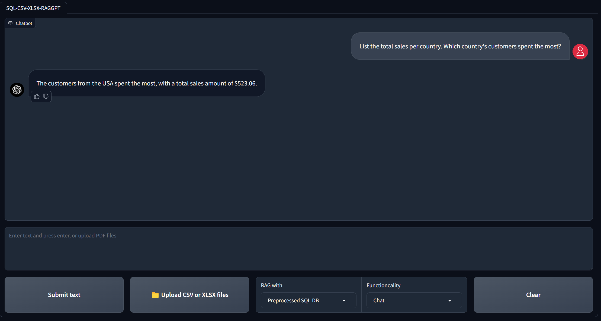

# Advanced-Multi-Modal-Chatbot-v1.0

An advanced multimodal chatbot integrating **Retrieval-Augmented Generation (RAG), Image Generation & Understanding, Speech-to-Text, and Real-Time Web Search** capabilities.

## Features

- **ChatGPT-Like Interaction** – Functions as a general AI assistant.
- **RAG Capabilities** – Supports retrieval from:
  1. Preprocessed documents.
  2. User-uploaded documents.
  3. Any requested website.
- **Image Generation** – Uses **Stable Diffusion** to generate images.
- **Image Understanding** – Analyzes image content and answers related questions using the **LLaVA model**.
- **Web Search Integration** – Retrieves real-time information via the **DuckDuckGo search engine**.
- **Summarization** – Generates summaries for websites and documents.
- **Text & Voice Interaction** – Accepts both text and voice inputs.
- **Memory Retention** – Maintains session-based memory for a more personalized experience.

### **Note:** This chatbot incorporates functionalities from both **RAG-GPT** and **WebRAGQuery** projects.

## YouTube Demo:
[Watch Here](https://youtu.be/AAvqscJPXIY?si=ApZ9-WfFfyGbcd-H)

---

## Core Technologies
- **LLM Chains & Agents**
- **GPT Function Calling**
- **Retrieval-Augmented Generation (RAG)**

---

## Models Used
- **GPT-3.5** – [Details](https://platform.openai.com/docs/models)
- **text-embedding-ada-002** – [Details](https://platform.openai.com/docs/models)
- **llava-hf/llava-v1.6-mistral-7b-hf** – [Code](https://github.com/haotian-liu/LLaVA) | [Demo](https://llava.hliu.cc/) | [Website](https://llava-vl.github.io/blog/2024-01-30-llava-next/) | [Models](https://github.com/haotian-liu/LLaVA/blob/main/docs/MODEL_ZOO.md#llava-v16)
- **stabilityai/stable-diffusion-xl-base-1.0** – [Details](https://huggingface.co/stabilityai/stable-diffusion-xl-base-1.0)
- **openai/whisper-base.en** – [Details](https://huggingface.co/openai/whisper-base.en)

---

## System Requirements
- **Operating System:** Linux or Windows Subsystem for Linux (WSL).
- **GPU VRAM:** Minimum **15 GB** required.
- **OpenAI / Azure OpenAI Credentials:** Required for GPT functionality.

---

## Installation

### **1. System Setup**
```
sudo apt update && sudo apt upgrade
python3 -m venv chatbot-env
git clone <repository>
```

### **2. Navigate to the Project Directory**
```
cd multimodal-chatbot
```

### **3. Activate the Virtual Environment**
```
source ...Path to the environment/chatbot-env/bin/activate
pip install -r requirements.txt
```

*All models are accessed directly from HuggingFace; manual downloads are not required.*

---

## Execution

### **Preparing Documents for RAG**
Copy PDF files into the `data/docs` directory and run:
```
python src/prepare_vectordb_from_docs.py
```

### **One-Click Chatbot Execution**
Run the following script:
```
./run_chatbot.sh
```

### **Accessing the Chatbot UI**
Once the chatbot is running, visit:
[http://127.0.0.1:7860](http://127.0.0.1:7860)

### **Stopping the Chatbot**
- **Detach from session:** Press **Ctrl + b**, then release both keys and press **d**.
- **Terminate session in the terminal:**  
```
tmux kill-session -t chatbot
```

---

## **Manual Execution (Alternative Approach)**

Launch each service in a separate terminal:

#### **Terminal 1: RAG Reference Service**
```
python src/utils/web_servers/rag_reference_service.py
```

#### **Terminal 2: LLava Service**
```
python src/utils/web_servers/llava_service.py
```

#### **Terminal 3: Stable Diffusion Service**
```
python src/utils/web_servers/sdxl_service.py
```

#### **Terminal 4: Speech-to-Text Service**
```
python src/utils/web_servers/stt_service.py
```

#### **Terminal 5: Launch Chatbot Interface**
```
python src/app.py
```
or
```
gradio src/app.py
```

---

## Chatbot User Interface
<div align="center">
  
</div>

---

## Project Schema
<div align="center">
  
</div>

---

## Key Frameworks & Libraries
- **LangChain** – [Introduction](https://python.langchain.com/docs/get_started/introduction)
- **DuckDuckGo Search Engine** – [Documentation](https://pypi.org/project/duckduckgo-search/)
- **Gradio** – [Documentation](https://www.gradio.app/docs/interface)
- **OpenAI API** – [Quickstart](https://platform.openai.com/docs/quickstart?context=python)
- **Transformers Library** – [Documentation](https://huggingface.co/docs/transformers/en/index)
- **ChromaDB** – [Documentation](https://docs.trychroma.com/)
- **BeautifulSoup (bs4)** – [Documentation](https://beautiful-soup-4.readthedocs.io/en/latest/)
